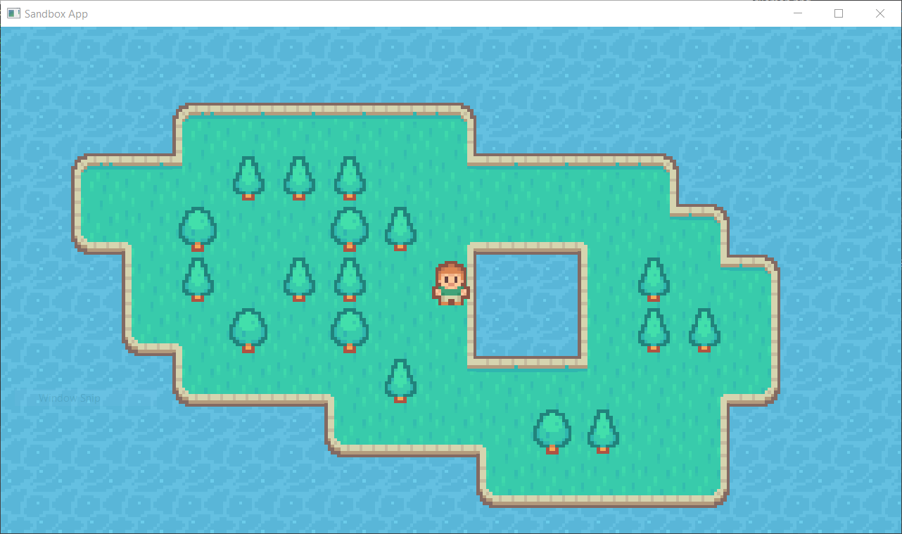
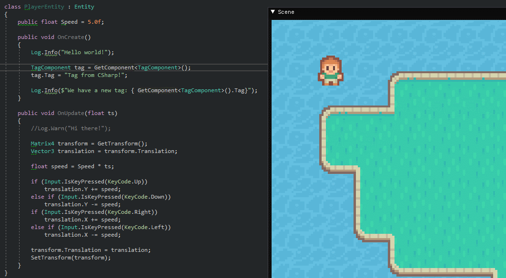
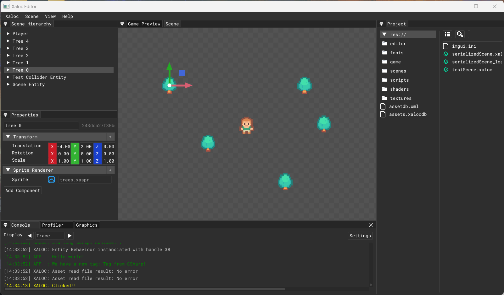

<h1 align="center" style="border-bottom: none;">
  <a href="https://github.com/pacojq/Xaloc/">Xaloc Engine</a>
</h1>

<p align="center">
  
</p>

<p align="center">
  <a href=""></a>
  
  <a href=""></a>
  <br/>
  <!-- <a href=""></a> -->
  
</p>

> Sirocco (Catalan: _Xaloc_).
> 
> From arabic, _shaluq_ 'wind from the sea' .
> 
> A Mediterranean wind that comes from the Sahara and can reach hurricane speeds in North Africa and Southern Europe, especially during the summer season.


## About

Xaloc is an in-development 2D game engine written in C++, allowing an ECS approach and C# scripting.

I develop it in my spare time as a personal project, so expect frequent periods of time with no activity in this repository.

<p align="center">
    
</p>

## Set up

You can clone Xaloc using git. Make sure you do a ```--recursive``` clone!

```git clone --recursive https://github.com/pacojq/Xaloc```

Xaloc Engine is built in a Windows environment, using Visual Studio 2019. 

Execute the script `scripts/Win-GenProjects.bat` 
to generate the solution and project files.

### Vulkan 

To work with the Vulkan API, you should first install the [Vulkan SDK](https://vulkan.lunarg.com/sdk/home).


## Compiling and Executing

The default startup project is the `Sandbox` App.

Remember to build the **entire solution** if you modify the C# files in `SandboxCs`, since the `.dll` file for the
scripting project is generated appart from the main Sandbox application.

<p align="center">
    
</p>


## Current Features

Right now, Xaloc is very bare-bones. Its most basic features are:

| Feature | Description | Status |
| ------- | ----------- | ------ |
| **Scene system** | Scene-based entity management. Scene serialization with XML. | WIP 💻 |
| **ECS support** | Entity Component System approach through *entt*. Sort list of components, including `TransformComponent`, `SpriteRenderer`, `TagComponent` and `BehaviourComponent`. | Done✔️ |
| **C# scripting** | Basic scripting in C# using mono. | Done✔️ |
| **2D Renderer** | 2D batch renderer supporting OpenGL. | Done✔️ |
| **ImGui support** | Basic game editor and in-game debug UI using ImGui. | Done✔️ |


 > For in-development features, check the [dev branch](https://github.com/pacojq/Xaloc/tree/dev).
 

## Planned Features

| Feature | Description | Status |
| ------- | ----------- | ------ |
| **Vulkan support** | Extend the Renderer to supports Vulkan. | WIP 💻 |
| **Physics system** | Own 2D physics API. | TODO 📋 |
| **Audio system** | Sound API. | TODO 📋 |
| **Font support** | Extend the Renderer capabilities so it can draw text. | TODO 📋 |


The game editor is in continuous development.

<p align="center">
    
</p>


## Dependencies

Xaloc has the following dependencies:

  - [ImGui](https://github.com/ocornut/imgui) for GUI rendering.
  - [mono](https://www.mono-project.com/docs/about-mono/) for C# [scripting](https://www.mono-project.com/docs/advanced/embedding/scripting/).
  - [GLFW](https://github.com/glfw/glfw) for OpenGL, OpenGL ES, window creation 
  and input handling. More info at its [website](https://www.glfw.org/).
  - [Glad](https://glad.dav1d.de) for OpenGL rendering.
  - [glm](https://github.com/g-truc//glm) as math(s) library.
  - [entt](https://github.com/skypjack/entt) for ECS management.
  - [spdlog](https://github.com/gabime/spdlog) for logging.
  - [stb_image.h](https://github.com/nothings/stb) for loading textures.
  - [pugixml](https://pugixml.org) for scene serialization in XML.

Projects are generated with [Premake 5](https://github.com/premake/premake-core/releases).

## Special Mentions

Huge shout out to:

  - TheCherno's [video series](https://www.youtube.com/playlist?list=PLlrATfBNZ98dC-V-N3m0Go4deliWHPFwT). Original code at [TheCherno/Hazel](https://github.com/TheCherno/Hazel).
  - Alexander Overvoorde's [Vulkan tutorial](https://vulkan-tutorial.com/Introduction).
